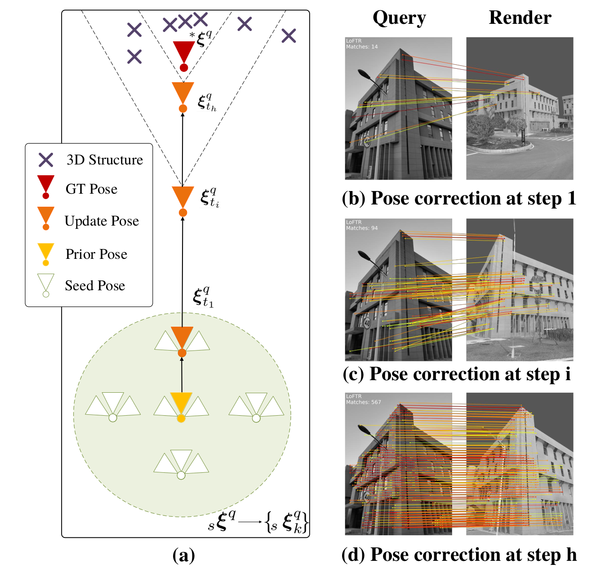
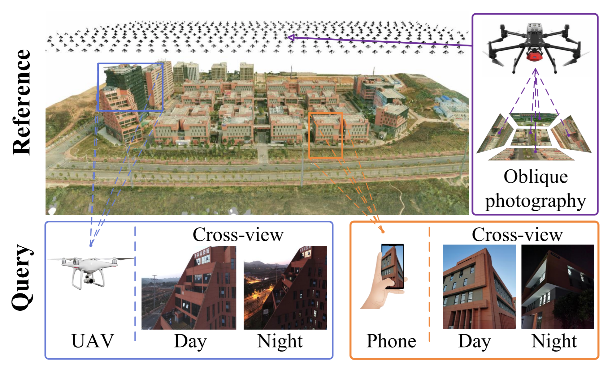

# Render-and-Compare: Cross-view 6-DoF Localization from Noisy Prior

This repository provides the implementation of the "Render-and-Compare: Cross-view 6-DoF Localization from Noisy Prior" as presented in the ICME 2023 paper by Shen Yan et al. from the National University of Defense Technology.

## Overview

The `Render-and-Compare` framework is designed to address the challenge of 6-DoF (six degrees of freedom) visual localization across different views, particularly from aerial to ground perspectives. Unlike traditional ground-level visual localization, this method leverages an iterative render-and-compare pipeline to enhance algorithm robustness, even when starting from noisy initial priors.

## Key Features

- **Cross-view Localization**: The method performs 6-DoF localization from aerial to ground views, overcoming the limitations of ground-level map collection.
- **Iterative Render-and-Compare Pipeline**: Utilizes an iterative approach to refine camera pose estimation by generating synthetic images and depthmaps for initial pose hypotheses.
- **Robustness to Noisy Priors**: Augments seeds from noisy initial priors provided by device sensors (e.g., GPS, compass) to improve robustness.
- **New Benchmark Dataset**: The paper introduces a new dataset, AirLoc, which includes a variety of cross-view images and groundtruth poses for evaluation.

## Installation

To set up the `Render-and-Compare` framework, follow these detailed steps:

1. **Create a Conda Environment**:
   Create a new Conda environment named `render2loc` from the provided `environment.yaml` file:
   ```shell
   conda env create -f environment.yaml
   conda activate render2loc
   ```

2. **Install Image Matching Toolbox**:
   Follow the installation guide for the [Image Matching Toolbox](https://github.com/GrumpyZhou/image-matching-toolbox/blob/main/docs/install.md):
   - Clone the repository:
     ```shell
     git clone https://github.com/GrumpyZhou/image-matching-toolbox.git
     ```
   - Install the Image Matching Toolbox as a Python package in the `render2loc` environment:
     ```shell
     cd image-matching-toolbox
     python setup.py develop
     ```

3. **Install COLMAP and PyCOLMAP from Sources**:
   - **COLMAP**: Install COLMAP from [source](colmap.github.io/install.html#build-from-source). COLMAP is a feature extraction and matching system which is essential for the image matching process.
   - **PyCOLMAP**: Install PyCOLMAP from [source](https://github.com/colmap/pycolmap). PyCOLMAP provides a Python interface to the COLMAP system.

4. **Install Blender**:
   As mentioned earlier, Blender is used as the rendering engine in this project. Download and install Blender from [https://www.blender.org/download/](https://www.blender.org/download/).


By following these steps, you will have a Conda environment set up with Python, the necessary packages, Blender, Image Matching Toolbox, COLMAP, and PyCOLMAP ready for use with the `Render-and-Compare` framework.
## Configuration

The `Render-and-Compare` framework requires a configuration file to set up the necessary parameters for execution. Here's an overview of the essential parts of the configuration file you should pay attention to:

```json
{
    "render2loc": {
        "dev": "phone", 
        "iter": 1, 
        "datasets": "/path/to/your/datasets/demo",  

    },
    "blender": {
        "blender_path": "/path/to/your/blender-3.3.1-linux-x64/blender",
        "python_rgb_path": "/path/to/your/utils/blender/RGB_renderer.py",  
        "python_depth_path": "/path/to/your/utils/blender/depth_renderer.py", 
        "python_importObjs_rgb_path": "/path/to/your/utils/blender/RGB_obj_importer.py",
        "python_importObjs_depth_path": "/path/to/your/utils/blender/depth_obj_importer.py",

    },
}
```
- **Dataset Path**: The `"datasets"` key should be set to the directory where your dataset is located.
- **Blender Executable**: The `"blender_path"` should point to the location where Blender is installed.
- **Python Scripts**: Update the paths for `"python_rgb_path"`, `"python_depth_path"`, `"python_importObjs_rgb_path"` and `"python_importObjs_depth_path"` to the locations of your custom Python scripts for rendering and importing 3D objects. These scripts are essential for the rendering process and must be correctly specified for the framework to function properly.

Make sure to customize the configuration file according to your specific file system structure and the locations where you have stored the necessary Blender executable and Python scripts.

## Usage


The `Render-and-Compare` framework follows a general pipeline for cross-view 6-DoF localization. Here's a simplified outline of the process, integrated with the steps from the general pipeline:

### Step 1: Initialization
Create an instance of the `Render2Loc` class with the path to your configuration file. This sets up the environment for the localization process.

```python
from Render2Loc import Render2Loc

render2loc = Render2Loc('configs/config_demo8.json')
```

### Step 2: Prepare the Environment
The system initializes the necessary components such as the texture model, matcher, and localizer using the configuration settings.

### Step 3: Augment Pose Perturbations (if needed)
For noisy sensors, especially in aerial views, create multiple virtual views by augmenting pose perturbations.


### Step 4: Generate and Load Texture Model
Generate the Blender project and load the necessary texture models for rendering.

### Step 5: Render Images
Using the specified engine (e.g., Blender), render RGB images and depthmaps for each virtual pose.

### Step 6: Match Query Images and Rendered Images
Perform feature matching between the query images and the rendered images. Note: You can use different matching algorithms by utilizing the **immatch toolbox**. Ensure you have the immatch toolbox installed and replace the matching algorithm as needed.

### Step 7: Transform Matches and Correct Virtual Pose
Convert 2D-2D matches to 2D-3D matches using depthmaps and correct the virtual pose using a PnP solver with LO-RANSAC loops.

### Step 8: Iterate Camera Optimizations
Repeat the iterative camera optimizations until the final pose rendering aligns with the query image.

### Main Execution
In the main block, instantiate the `Render2Loc` and perform localization:

```python
if __name__ == "__main__":
    # Initialize the Render2Loc system with the configuration file
    render2loc = Render2Loc('configs/config_demo.json')
    
    # Perform UAV localization with prior information
    ret = render2loc.UAV_localization_with_prior()
```

This streamlined workflow encapsulates the general pipeline within the usage instructions, providing a clear path from initialization to execution of the localization process. Adjustments may be necessary based on sensor noise levels and the specifics of the query images and prior poses.
## Dataset


The **AirLoc Dataset** is a comprehensive dataset designed for evaluating cross-view 6-DoF localization algorithms. It features a large urban area, capturing the complexities of modern cityscapes with diverse structures, roads, and natural elements.

### Access
The dataset is available on BaiduDesk (access code: !!) and Google Cloud, offering a rich collection of images and data for research and development purposes.

### Content
- **Size**: Approximately 100,000m² of urban area.
- **Images**: 1,970 reference images and 1,432 query images, offering a wide range of perspectives and conditions.
- **Capture Devices**: High-resolution aerial images taken by [SHARE PSDK 102S2](https://www.shareuavtec.com/ProductDetail/6519312.html) and [DJI M300 RTK](https://www.dji.com/cn/matrice-300).
- **3D Reconstruction**: Utilizes modern techniques to create textured mesh models, aligned with real-world geography using RTK measurements.
- **Conditions**: Includes images from various lighting conditions, such as day and night sessions.
- **Query Images**: Captured from ground-level smartphones and near-air UAVs, providing a true cross-view perspective.
- **Sensor Data**: Each session utilizes the [SensorLog Application](http://sensorlog.berndthomas.net) to record raw sensor data.

### Structure
To utilize the AirLoc Dataset or your own dataset with the Render2Loc pipeline, organize your data according to the following structure:

```
Render2Loc/
│
├── 3D-models/               # 3D models in COLMAP style (optional)
│   ├── cameras.txt
│   ├── images.txt
│   └── points3D.txt
│
├── gt_pose/                  # Ground truth poses
│   └── pose_gt.txt
│
├── images/                   # Image datasets
│   ├── images_upright/
│   │   ├── db/              # Optional database images
│   │   └── query/
│   │       └── ...jpg
│   └── render_upright/
│
├── queries/                  # Query data
│   └── query_intrinsics.txt  # Intrinsic parameters in Colmap format
│
├── results/                  # Results of the Render2Loc pipeline
│
├── sensors_prior/            # Sensor prior data
│   └── pose_prior.txt
│
└── texture_model/            # Texture models
    ├── Data/                # OBJ file for 3D models
    ├── dsm/
    │   └── DSM.tif          # Digital Surface Model map
    └── metadata.xml          # Metadata file with origin information
```

### Notes
- **Texture Model**: The 3D models are accompanied by texture information for accurate rendering.
- **Query Intrinsic**: Intrinsic parameters of the query camera should be in Colmap format, with pixel units for focal length. When rendering, you can choose between pixel and mm units.
- **Query Pose**: The pose of the query should be in the world-to-camera (w2c) format, compatible with Colmap.

The visual representation of the dataset in the paper illustrates the drastic view changes between the query and reference images, emphasizing the challenges and capabilities of the Render2Loc framework in handling cross-view localization tasks.


## Citation

For academic use, please cite the following paper:

Shen Yan, Xiaoya Cheng, Yuxiang Liu, Juelin Zhu, Rouwan Wu, Yu Liu, Maojun Zhang, "Render-and-Compare: Cross-view 6-DoF Localization from Noisy Prior", ICME 2023.

```bibtex
@article{yan2023render2loc,
  author={Yan, Shen and Cheng, Xiaoya and Liu, Yuxiang and Zhu, Juelin and Wu, Rouwan and Liu, Yu and Zhang, Maojun},
  booktitle={2023 IEEE International Conference on Multimedia and Expo (ICME)}, 
  title={Render-and-Compare: Cross-view 6-DoF Localization from Noisy Prior}, 
  year={2023},
  pages={2171-2176},
  doi={10.1109/ICME55011.2023.00371}}
```
